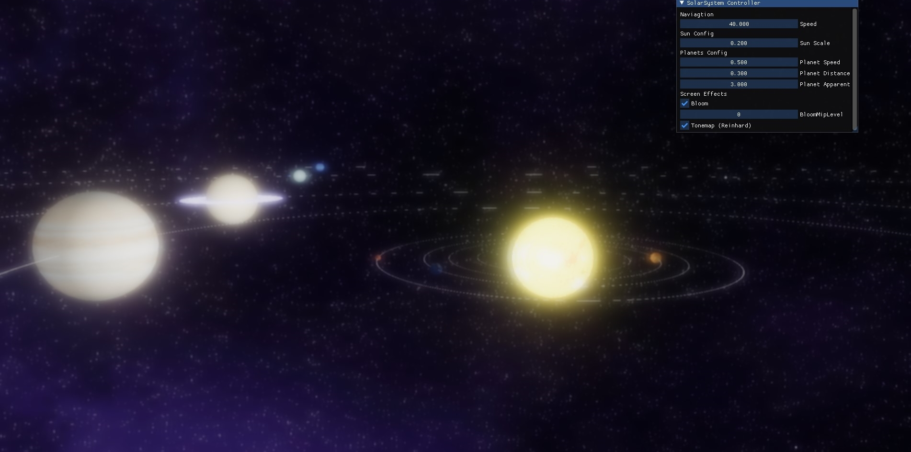

# SolarSystemGL

A visualization of the Solar System using OpenGL

---

This project intends to develop advanced OpenGL and Rendering concepts such as:

- Framebuffers
- 3D Model Loading
- Bloom
- Tonemapping/Post-Processing
- Modern Texture Representations (Texture Arrays)